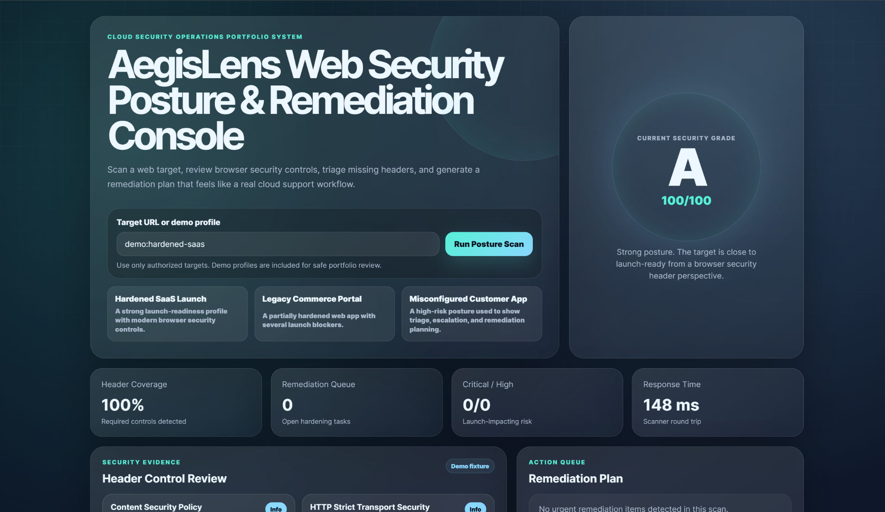
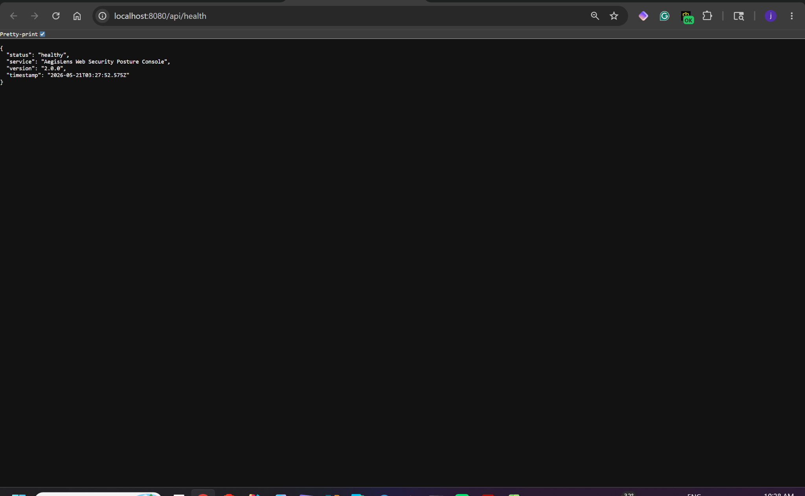

# AegisLens Web Security Posture & Remediation Console

## Overview

AegisLens is a full-stack web security posture review console designed for cloud support, application security, and launch-readiness workflows.

The original project was a static browser dashboard. This upgraded version adds a working Express backend, scanner API, security-header scoring engine, demo target fixtures, runtime scan history, remediation logic, automated tests, Docker readiness, and a polished cloud-operations interface.

## Screenshots

### Dashboard Overview



### Backend Health Endpoint


## Real-World Use Case

A cloud support or application security team may need to review a customer-facing web application before launch, migration, or production release.

AegisLens helps answer:

- Are important browser security headers present?
- Is HTTPS posture acceptable?
- Are cookies missing Secure, HttpOnly, or SameSite protections?
- Is the app exposing server or framework details?
- Which remediation tasks should be escalated first?
- What should cloud support, platform, and application teams fix before release?

## Key Features

- Full-stack Node.js and Express application
- Frontend dashboard served from the backend
- Safe URL scanning API
- Demo target profiles for portfolio review
- Security header scoring engine
- Grade and score calculation
- Remediation queue with severity and ownership
- Runtime scan history
- API health endpoint
- Automated scanner tests
- Dockerfile for container readiness
- Cloud support focused documentation

## Tech Stack

- Node.js
- Express
- JavaScript ES Modules
- HTML
- CSS
- Browser Fetch API
- Helmet
- CORS
- Docker

## Project Structure

```text
.
├── public/
│   ├── index.html
│   ├── styles.css
│   └── app.js
├── src/
│   ├── scanner.mjs
│   └── data/
│       └── demoTargets.mjs
├── tests/
│   └── scanner.test.mjs
├── docs/
│   └── architecture.md
├── server.mjs
├── package.json
├── Dockerfile
├── .env.example
└── README.md

